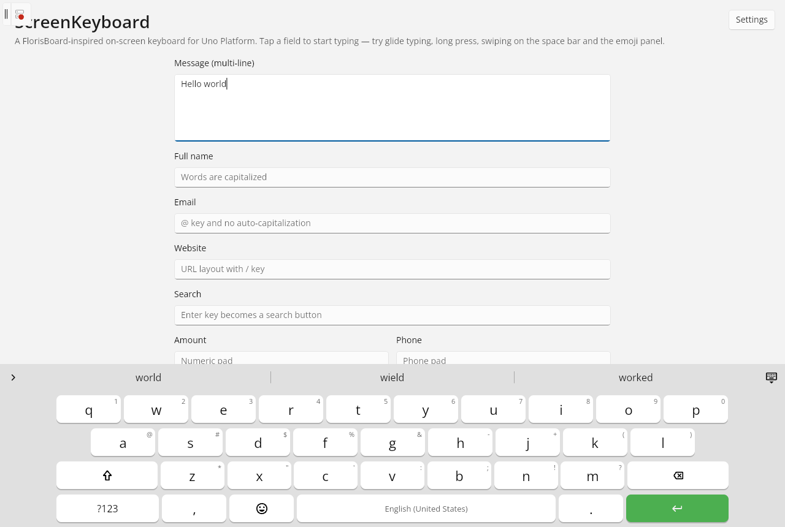
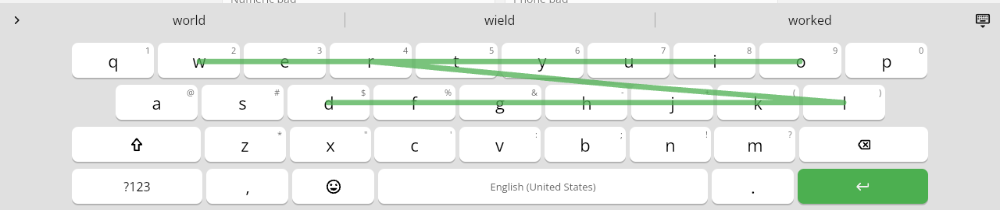
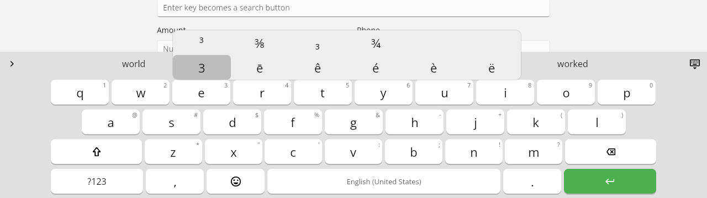
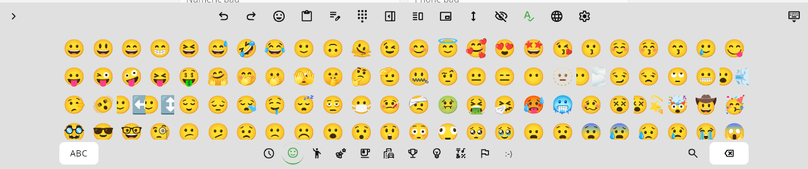
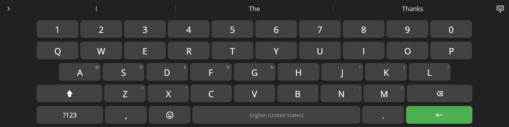
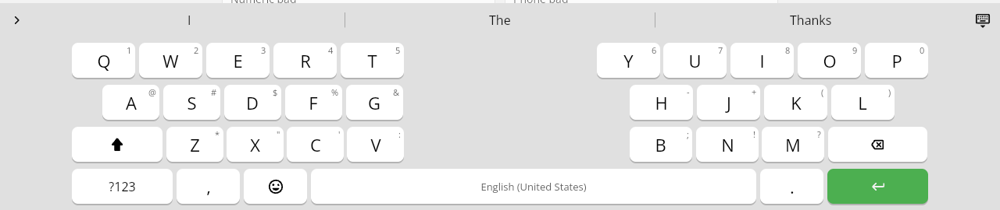
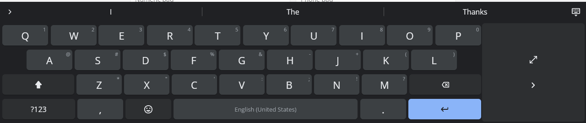
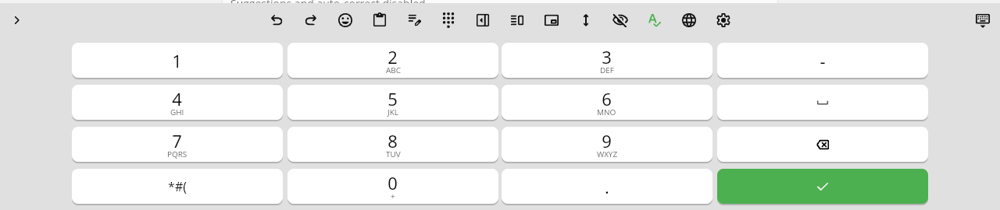
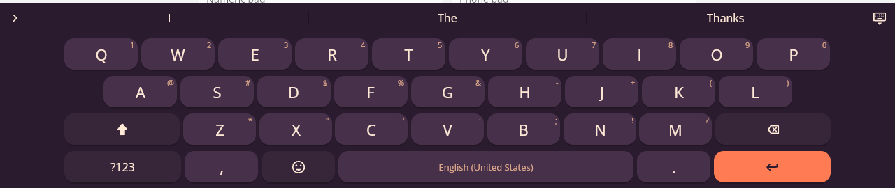
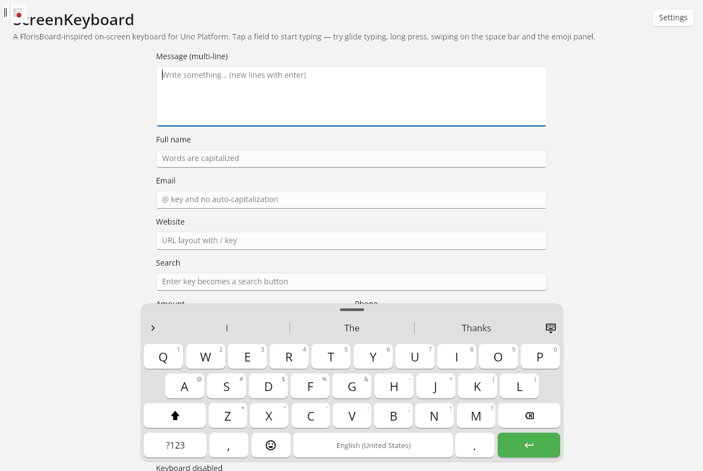

<div align="center">

# ScreenKeyboard

**A professional, open-source on-screen keyboard for [Uno Platform](https://platform.uno) — inspired by and built on [FlorisBoard](https://github.com/florisboard/florisboard).**

Glide (swipe) typing · gestures · emoji · clipboard history · smart suggestions · 90+ layouts · 70+ languages · fully themable

[](https://github.com/wieslawsoltes/ScreenKeyboardControl/actions/workflows/ci.yml)
[](https://www.nuget.org/packages/ScreenKeyboard.Uno)
[](https://www.nuget.org/packages/ScreenKeyboard.Core)
[](LICENSE)



</div>

ScreenKeyboard brings a mobile-grade keyboard to every Uno Platform target — WebAssembly, Windows, macOS, Linux
(X11 and framebuffer), Android and iOS. It is ideal for kiosks, point-of-sale terminals, industrial panels,
touch-screen desktops, in-car and TV apps, and any application that needs full control over text input.

The typing engine is platform independent (`ScreenKeyboard.Core`, pure .NET, fully unit tested), and the UI
(`ScreenKeyboard.Uno`) is a lightweight, code-built WinUI control that never steals focus from your text fields.

## Highlights

| | |
|---|---|
| ⌨️ **Layouts** | All FlorisBoard layouts (QWERTY, QWERTZ, AZERTY, Dvorak, Colemak, Workman, BÉPO, Neo2, JCUKEN, Greek, Hebrew, Arabic, Persian, Hindi, Bengali, Tamil, Thai, Korean, Japanese JIS, Armenian, Georgian and many more), symbols pages, numeric, phone and advanced numeric pads. Add your own in JSON. |
| 🌍 **70+ languages** | FlorisBoard subtype presets with per-language popups (accents), currency symbols, punctuation rules and composers (Hangul syllables, Japanese kana, Vietnamese Telex). |
| ✍️ **Glide typing** | C# port of FlorisBoard's statistical glide classifier with live preview and a fading trail. |
| 👆 **Gestures** | Configurable swipe up/down/left/right, space bar cursor control, swipe-to-delete words precisely, long-press actions, multi-touch rollover, shift chording, key repeat. |
| 💡 **Smart typing** | Word completion, keyboard-aware autocorrect (with undo on backspace), next-word prediction, learning user dictionary, auto-capitalization, double-space period, smart punctuation spacing. |
| 😀 **Emoji** | Complete CLDR emoji set with categories, skin tones, recents & pinning, keyword search in 6 languages, `:shortcode` suggestions and classic emoticons. |
| 📋 **Clipboard** | Clipboard history with pinning, expiry and one-tap paste; recently copied text suggested in the smartbar. |
| ✏️ **Editing panel** | Cursor pad, selection mode, select all, copy/cut/paste, undo/redo, line and document navigation. |
| 🎨 **Theming** | 12 built-in themes (Floris Day/Night/borderless/AMOLED, Material, Nord, Ocean, Rosé, High Contrast, Terminal), light/dark following the system, JSON themes and per-key style rules. |
| 🧩 **Configurable** | 60+ observable settings: key height (plus interactive resize mode), spacing, font scale, one-handed mode, split keyboard, floating keyboard, number row, hint priority, utility key, smartbar layout, haptics, incognito… |
| ♿ **Accessible** | Automation names on keys, high-contrast theme, adjustable sizes and delays. |

| | |
|:---:|:---:|
|  |  |
| Glide typing with live predictions | Long-press popups with accents and symbols |
|  |  |
| Emoji panel with categories and skin tones | Floris Night theme with number row |
|  |  |
| Split keyboard for tablets | One-handed mode (Material Dark) |
|  |  |
| Phone pad and quick actions | Custom theme defined in XAML |

<p align="center"><br/><em>Floating, draggable keyboard</em></p>

## Packages

| Package | Description |
|---|---|
| [`ScreenKeyboard.Uno`](https://www.nuget.org/packages/ScreenKeyboard.Uno) | The Uno Platform controls (`OnScreenKeyboard`, `ScreenKeyboardHost`), themes and input adapters. |
| [`ScreenKeyboard.Core`](https://www.nuget.org/packages/ScreenKeyboard.Core) | UI-independent engine: layouts, key computation, gestures, glide typing, NLP, emoji, clipboard, settings. Usable from any .NET UI framework. |

Targets: `net10.0` (Skia desktop & reference), `net10.0-desktop`, `net10.0-browserwasm`, `net10.0-android`,
`net10.0-ios` and `net10.0-windows10.0.26100` (WinAppSDK). Built with Uno.Sdk 6.7.

## Quick start

```bash
dotnet add package ScreenKeyboard.Uno
```

Wrap your page content in a `ScreenKeyboardHost`. The keyboard slides in whenever a `TextBox` or `PasswordBox`
gets focus and keeps the focused field visible:

```xml
<Page xmlns:sk="using:ScreenKeyboard.Controls">
  <sk:ScreenKeyboardHost>
    <StackPanel Spacing="12" Padding="24">
      <TextBox Header="Name" InputScope="PersonalFullName" />
      <TextBox Header="Email" InputScope="EmailSmtpAddress" sk:ScreenKeyboardInput.EnterAction="Next" />
      <TextBox Header="Amount" InputScope="Number" />
      <PasswordBox Header="PIN" />
    </StackPanel>
  </sk:ScreenKeyboardHost>
</Page>
```

Or place the keyboard yourself — it attaches to the focused input of its window automatically:

```xml
<Grid RowDefinitions="*,Auto">
  <TextBox AcceptsReturn="True" />
  <sk:OnScreenKeyboard Grid.Row="1" />
</Grid>
```

Configure everything in code:

```csharp
var keyboard = host.Keyboard;
keyboard.Settings.Subtypes = ["en-US/qwerty", "de-DE/qwertz", "fr-FR/azerty"];
keyboard.Settings.ThemeMode = ThemeMode.Dark;
keyboard.Settings.DarkTheme = "floris_pure_night";
keyboard.Settings.NumberRow = true;
keyboard.Settings.OneHandedMode = OneHandedMode.Right;
keyboard.EnterActionRequested += (s, e) => { if (e.Action == EnterAction.Search) { Search(); e.Handled = true; } };
```

On WebAssembly (and other Skia targets without a color emoji font) enable emoji rendering once at startup:

```csharp
if (OperatingSystem.IsBrowser())
    EmojiFontFallback.UseNotoColorEmoji();
```

## Documentation

| Topic | |
|---|---|
| [Getting started](docs/getting-started.md) | Installation, host vs. standalone keyboard, first steps |
| [Input integration](docs/input-integration.md) | TextBox/PasswordBox, `InputScope` mapping, attached properties, enter actions, custom targets |
| [Layouts & languages](docs/layouts.md) | FlorisBoard JSON format, custom layouts, subtypes, popups, composers, currency sets |
| [Theming](docs/theming.md) | Built-in themes, custom themes in C#, XAML and JSON, key style rules |
| [Configuration](docs/configuration.md) | Every `KeyboardSettings` option, persistence |
| [Gestures & glide typing](docs/gestures.md) | Swipe actions, space bar and delete gestures, glide typing |
| [Suggestions & dictionaries](docs/suggestions.md) | Autocorrect, predictions, user dictionary, custom dictionaries and providers |
| [Emoji & clipboard](docs/emoji-and-clipboard.md) | Emoji catalog, skin tones, search, fonts; clipboard history |
| [Architecture](docs/architecture.md) | Engine, touch processor, rendering, extending the keyboard |
| [Building & releasing](docs/building.md) | Repository layout, tests, samples, CI, NuGet packaging |

## Sample app

[`samples/ScreenKeyboard.Sample`](samples/ScreenKeyboard.Sample) demonstrates every feature with a live settings
pane (themes, languages, gestures, typing options) and persistence of settings, learned words and emoji history.

```bash
dotnet run --project samples/ScreenKeyboard.Sample -f net10.0-desktop
dotnet run --project samples/ScreenKeyboard.Sample -f net10.0-browserwasm
```

Start-up options such as `?theme=dark&onehanded=right&langs=en-US/qwerty,de-DE/qwertz` (WebAssembly) or
`--theme=dark` (desktop) make it easy to try configurations.

## Using the engine without Uno

`ScreenKeyboard.Core` has no UI dependencies. Drive it from tests, another UI framework or a server:

```csharp
var engine = new KeyboardEngine();
var field = new TextBufferTarget();
engine.Attach(field);
engine.TypeText("i like teh ");
Console.WriteLine(field.Text); // "I like the "
```

## Credits

ScreenKeyboard would not exist without [FlorisBoard](https://github.com/florisboard/florisboard) by Patrick Goldinger
and contributors: its layouts, localization data, emoji data, dictionary and several algorithms (glide typing, layout
merging and key sizing, composers) are used or ported under the Apache License 2.0. Icons are
[Material Symbols](https://github.com/google/material-design-icons). See [NOTICE](NOTICE) and
[THIRD-PARTY-NOTICES](THIRD-PARTY-NOTICES.md).

## Contributing

Contributions are welcome — see [CONTRIBUTING.md](CONTRIBUTING.md). Please report security issues as described in
[SECURITY.md](SECURITY.md).

## License

[Apache License 2.0](LICENSE)
