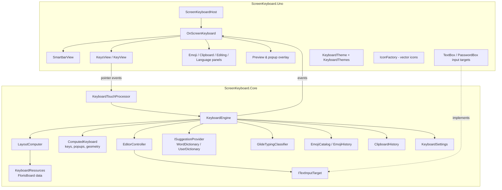

# Architecture

ScreenKeyboard is split into a UI-independent engine and a thin Uno Platform presentation layer.

## Core

| Type | Responsibility |
|---|---|
| `KeyboardResources` | Registry of layouts, popup mappings, subtype presets, composers, currency sets and punctuation rules. `Default` loads the bundled FlorisBoard extensions lazily from embedded (gzip compressed) resources. |
| `LayoutJson` | Reflection-free (AOT/trimming safe) reader and writer of FlorisBoard JSON. |
| `LayoutComputer` | Merges extension (number row), main and modifier layouts into rows and attaches number/symbol hint sources. |
| `ComputedKeyboard` / `ComputedKey` | Evaluates key selectors for the current state (shift, variation, direction...), computes labels, icons, popups and hints, and lays keys out with the flexible width algorithm (including split mode). Provides hit testing. |
| `KeyboardEngine` | The state machine: modes, shift/caps lock, panels, subtypes; turns key events into edits (composers, auto-capitalization, auto-correct, punctuation spacing, double-space period), manages suggestions, glide typing, clipboard and emoji history. Raises events for the UI. |
| `EditorController` | Grapheme-aware editing, word/line navigation, selection mode, undo/redo on top of `ITextInputTarget`. |
| `KeyboardTouchProcessor` | Pointer state machine: taps, rollover, long press popups, repeat, glide detection, space bar cursor, precise delete, swipes. Uses `IKeyboardScheduler` for timers so it runs deterministically in tests. |
| `GlideTypingClassifier` | Statistical glide recognizer (port of FlorisBoard). |
| `WordDictionary`, `UserDictionary`, `DictionarySuggestionProvider` | Trie based completion, fuzzy correction with key proximity, learning and predictions. |
| `EmojiCatalog`, `EmojiHistory` | CLDR emoji data, skin tones, search, recents. |
| `ClipboardHistory` | History with pins and expiry. |
| `KeyboardSettings` | Observable, JSON-serializable options (System.Text.Json source generation). |

The engine is single-threaded by design (call it from the UI thread); shared data structures (resources,
dictionaries, language models) are thread safe.

## Uno layer

- `OnScreenKeyboard` (a `UserControl` built in code) composes the smartbar, the keys view, the panels and an
  overlay canvas for key previews and popups. It wires engine events, applies themes and settings, tracks focus
  (`FocusManager.GotFocus`) and hosts the emoji search mode.
- `KeysView` creates one `KeyView` per key and positions it at the engine-computed bounds. Pointer events (with
  intermediate points for smooth glide trails) go to the touch processor.
- `TouchButton` is a focus-neutral button used for every interactive element, and `FocusNeutral` disables
  focus-on-interaction for every element of the keyboard, so the edited field always keeps focus.
- `DispatcherKeyboardScheduler` implements timers with `DispatcherQueueTimer`.
- `TextBoxInputTarget` maps `InputScope`/`AcceptsReturn`/attached properties to `InputAttributes` and filters the
  asynchronous `TextChanged`/`SelectionChanged` notifications caused by the keyboard itself.

## Rendering pipeline

1. The engine builds a `ComputedKeyboard` for `(mode, subtype, numberRow)` (cached) and evaluates it with a
   `KeyComputeContext` whenever the state changes.
2. `KeysView` reports its size; the engine lays out keys (`KeyboardGeometryOptions`: spacing, split gap).
3. `KeyView.Update` resolves the style (`KeyStyles.Resolve` + theme `KeyRules`) and renders background, shadow,
   label/icon, hint and sub-label.

## Extending

- **New layouts/languages**: JSON or code, see [Layouts](layouts.md).
- **New themes**: [Theming](theming.md).
- **New suggestion engines**: `ISuggestionProvider`, see [Suggestions](suggestions.md).
- **New input targets**: `ITextInputTarget`, see [Input integration](input-integration.md).
- **Quick actions**: `OnScreenKeyboard.SmartbarActions` is a mutable list of `SmartbarAction(id, icon, name, execute, isActive)`.
- **Other UI frameworks**: reuse `ScreenKeyboard.Core` — render `engine.Keyboard` (keys expose bounds, labels,
  icons, hints and popups), forward pointers to `KeyboardTouchProcessor` and react to engine events.
